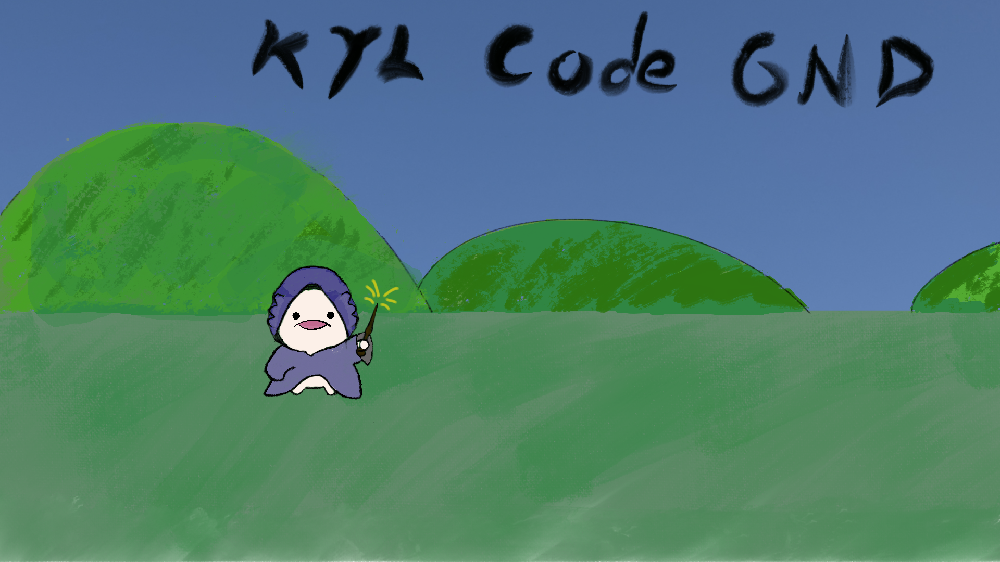

---

## Welcome to my personal website !

You can walk around here and find something you need. I place some my coding experience and discussion here. All materials are public and attached with the corresponding repositories.

## Table of Contents
* About
* Contents
    * Introduction of Computer
    * Program Development
    * Digital Circuits
    * Processor
    * VLSI
    * Embedded System
* Contact

## About
When I was pursuing my bachelor degree of the computer science at the National Cheng Kung University (NCKU), I tried many topics and area which includes backend software programming, front-end website designing, digital circuit design, machine learning, deep neural-network implementation, and so on. In the end, I decided to master the digital circuit design and started researches about the Very Large-Scale Integrated circuit (VLSI). There are many experiences that I want to keep in mind and attempt to share them with friends. Therefore, with recent increasing trend of using generative AI techinque in coding, I am able to keep doing research and developing my personal website at the same time. I will put some knowledge or experience at this website as my personal references, which are also good to others. Well, let's improve our ability together!

## Contact
### Email: kuoyu6092@gmail.com

